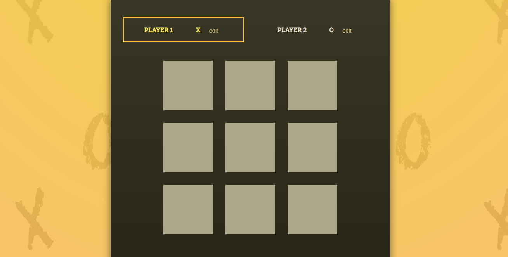

### Tic-Tac-Toe-Game

Screenshots1

  
  

Screenshots3

Screenshots4

Screenshots5

Screenshots6

This is a basic Tic-Tac-Toe game built using React. 
The game allows two players to take turns placing their marks (X and O) on a 3x3 grid. 
The goal is to align three of their marks either horizontally, vertically, or diagonally before the opponent does.

Features:
Interactive game board that updates in real-time.
Displays the winner when a player successfully aligns three marks or announces a tie if all spaces are filled without a winner.
Clean and minimalist UI for an enjoyable playing experience.
Efficient state management using React hooks.
Code is modular and easy to understand for beginners.
